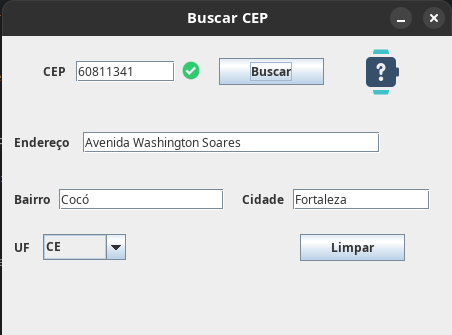

# Buscador de CEP em Java :coffee:
Um projetinho para sistemas desktop que faz uma busca automática do endereço a partir do CEP usando Web Service e feito em Java.

## Tecnologias e Técnicas utilizadas :computer:
- Java SE
- Window Builder
- Web Service: [Republica Virtual](https://www.republicavirtual.com.br/)
- Biblioteca dom4j para trabalhar com xml
- Biblioteca atxy2k para limitar o comportamento JTextField em Java

## Bibliotecas 📚
- [atxy2k](http://atxy2k.github.io/RestrictedTextField/)
- [dom4j](https://dom4j.github.io/)